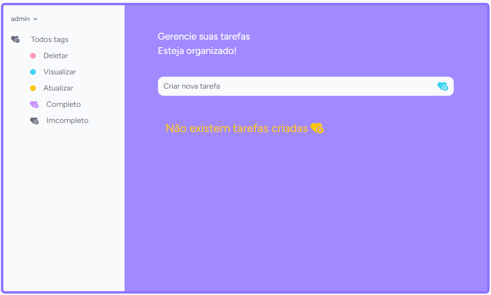

# TODO APP
Este projeto envolve o desenvolvimento de uma aplicação web completa, desde o início até o deploy final, utilizando o framework Laravel para o back-end e a engine de templates Blade para o front-end. A aplicação será um sistema básico de gerenciamento de tarefas (to-do list), permitindo que os usuários criem, visualizem, editem e excluam suas tarefas.



## 🛠️ Tecnologias Utilizadas

### Linguagem de Programação
- [PHP] - PHP: Utilizado para a lógica de backend.

### 🛠️ Frameworks e Bibliotecas
- [Laravel] - Principal framework PHP utilizado para estruturar o projeto;
- [PHPunit] - Ferramenta para teste unitário;
- [Composer] - Gerenciador de dependências para PHP;
- [Breeze] - Utilizado para autenticação no sistema de login;
- [Bootstrap] - Biblioteca para estilização do layout;
- [NPM] - Gerenciador de pacotes do nodeJs/Javascript.

### Banco de Dados
- [MySQL] - Utilizado para armazenamento dos dados. Arquivos de migração estão localizados em database/migrations.

## 🛠️ Ferramentas de Desenvolvimento
- [Artisan] - Ferramenta de linha de comando fornecida pelo Laravel para várias tarefas de desenvolvimento;
- [Factory] - Utilizado para gerar dados de teste, localizado em database/factories;
- [Vite] - Utilizado para buildar o projeto.

## 🚀 Como Executar o Projeto

### Passos para Execução

1. **Clone o repositório**

   ```sh
   git clone https://github.com/linusmanuel/todo-app.git
   cd Todo-App

2. **Configurar as variáveis de ambiente**

   ```sh
   cp .env.example .env
   ```

3. **Instalar as depências do Composer**

   ```sh
   composer install
   ```
   ```sh
   npm install

4. **Gerar a chave da aplicação**

   ```sh
   php artisan key:generate

5. **Configurar o banco de dados**
- No arquivo .env, configure as variáveis de ambiente DB_DATABASE, DB_USERNAME e DB_PASSWORD conforme o seu ambiente de desenvolvimento.

6. **Executar as migrações e seeders**

   ```sh
   php artisan migrate --seed

7. **Iniciar o servidor de desenvolvimento**

   ```sh
   php artisan serve
   ```

   ```sh
   npm run dev

7. **Acessar a aplicação**
- Abra o navegador e acesse http://servidor:configurado.

## Arquitetura do Projeto

### MVC(Model-View-Controller): Estrutura utilizada para organizar o código.

- [Models] - Representações dos dados, localizadas em app/Models.
- [Views] - Recursos e respostas de dados, localizadas em app/Http/Resources.
- [Controllers] - Lógica de controle das requisições, localizados em app/Http/Controllers.
- [Middleware] - Camadas intermediárias para tratar requisições HTTP, localizadas em app/Http/Middleware.

## ✒️ Autor

- **Joao Lino** - _Desenvolvedor_ - <a href="https://github.com/linusmanuel" target="_blank">Joao Lino Manuel</a>

## 🎁 Expressões de gratidão

- Quanto mais difícil maior a satisfação 🙌
- Obrigado! 😉
